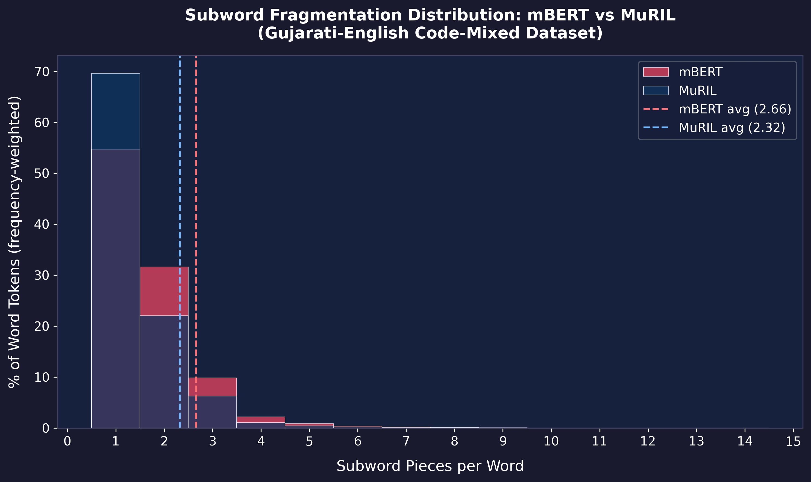
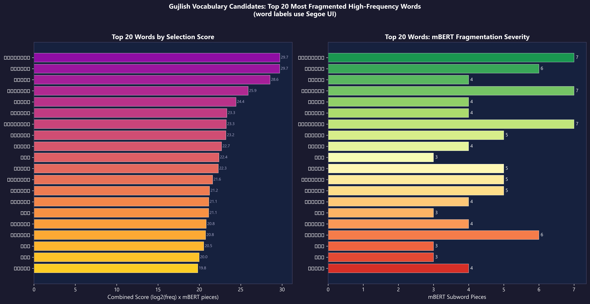
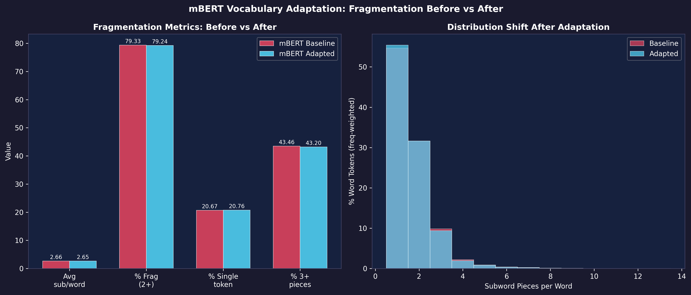
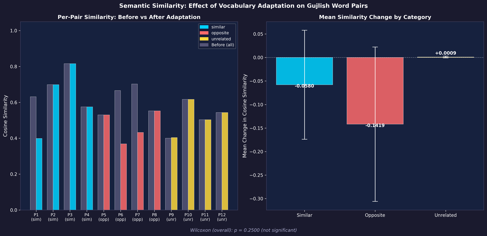
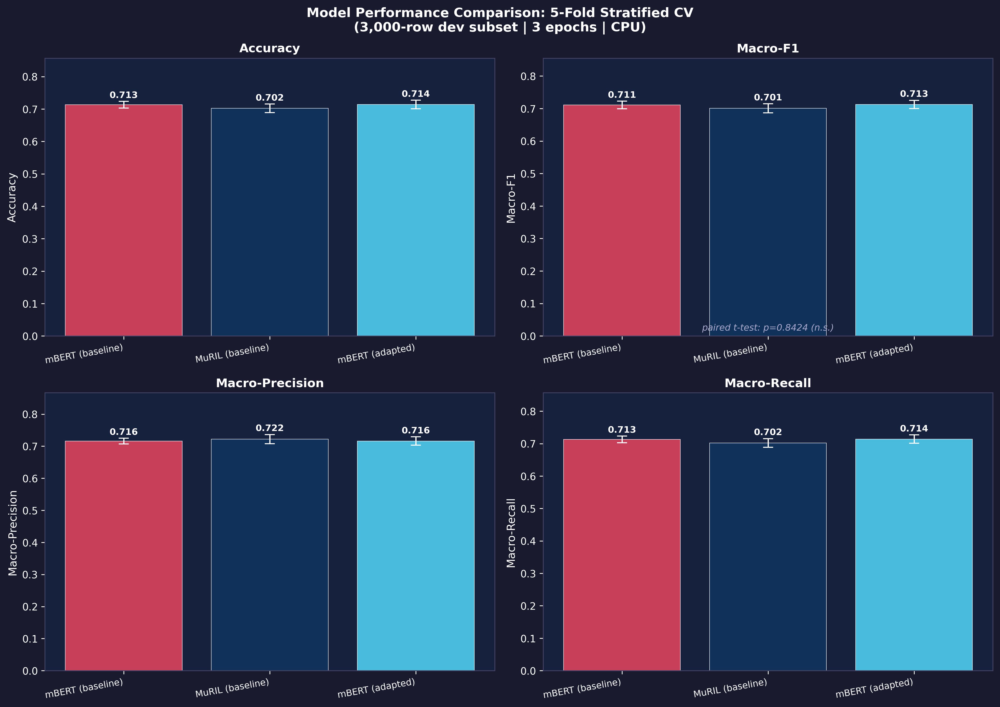
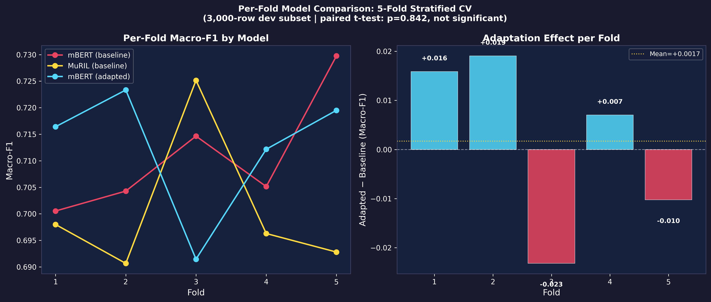
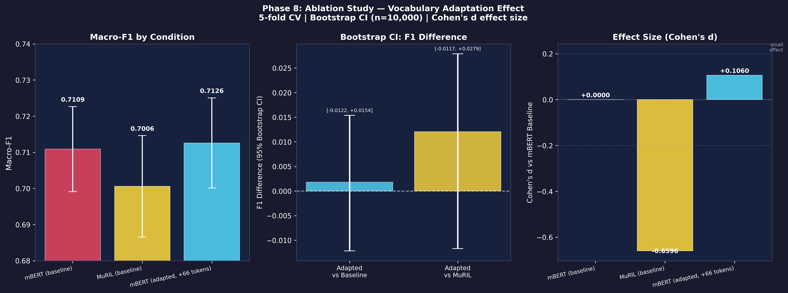
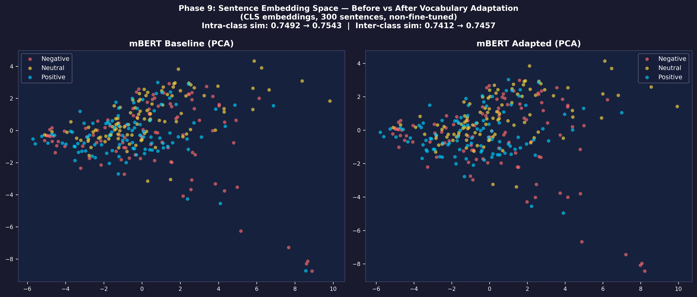
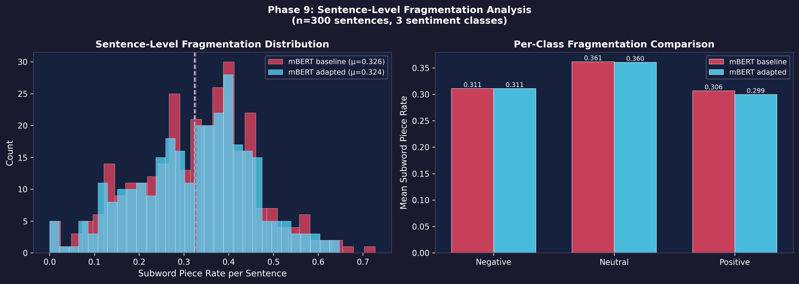

# RESULTS SUMMARY
**Paper**: *Investigating the Impact of Subword Tokenization Fragmentation on Semantic Representation of Gujarati-English Code-Mixed Text*

> This file is the single source of truth for writing the paper's Methodology, Results, and Discussion sections.
> Results are populated progressively as each phase completes.
> Values marked `[PENDING]` require the corresponding phase to finish.

---

## Table 1: Dataset Statistics

| Metric | Value |
|---|---|
| Raw rows downloaded | 21,729 |
| After Gujlish dominance filter (1.5×) | 21,359 (98.3% retained) |
| After cleaning (dedup, spam removal) | 21,346 (99.94% of filtered) |
| Dominance filter threshold | `(guj + eng) > 1.5 × hindi tokens` |
| Dev subset for experiments | 3,000 (stratified) |
| **Class: Positive** | 12,538 (58.7%) |
| **Class: Neutral** | 7,491 (35.1%) |
| **Class: Negative** | 1,317 (6.2%) |
| Avg sentence length (words) | 17.88 (median: 12) |
| Avg CMI score | 15.85 (max: 66.67) |
| English token share | 84.0% |
| Gujarati token share | 12.0% |
| Hindi token share | 4.0% |
| `model_predicted` labels | 20,765 (97.2%) |
| `llm_annotated` labels | 594 (2.8%) |

**Interpretation**: The filtered corpus is heavily English-dominant (84% English tokens), with Gujarati words embedded at ~12%. This reflects the natural code-mixing pattern in YouTube comments from Gujarati-speaking creators, where English serves as the matrix language and Gujarati is the embedded language. The severe class imbalance (negative = 6.2%) makes macro-F1 the appropriate primary metric for Phase 7.

---

## Table 2: Cleaning Report

| Step | Removed | % of Input |
|---|---|---|
| Empty/null rows | 0 | 0.00% |
| Missing label | 0 | 0.00% |
| Spam/pure-URL | 13 | 0.06% |
| Exact duplicates | 0 | 0.00% |
| **Total removed** | **13** | **0.06%** |
| **Remaining** | **21,346** | **99.94%** |

**Interpretation**: The dataset is very clean — only 13 spam/URL rows were removed. No spelling normalization was performed; natural variation (e.g., "chhe" vs "che") is preserved as it is part of the research signal.

---

## Figure 1: Subword Fragmentation Distribution

**Interpretation**: See Table 2b below.

---

## Table 2b: Tokenizer Fragmentation Baseline

| Metric | mBERT | MuRIL |
|---|---|---|
| Vocab size | 119,547 | 197,258 |
| Unique words analyzed | 51,182 | 51,182 |
| Avg subwords/word | **2.659** | **2.323** |
| Median subwords/word | 2.0 | 2.0 |
| % words fragmented (2+ pieces) | **79.3%** | **70.0%** |
| % words single token | 20.7% | 30.0% |
| % words 3+ pieces | 43.5% | 33.4% |
| Max pieces (any word) | 66 | 65 |
| Avg fragmentation ratio (frag. words) | 3.091 | 2.889 |

**Interpretation**: mBERT fragments 79.3% of all unique words in this corpus — a strikingly high rate driven by Gujarati-script words that are almost entirely absent from its vocabulary. MuRIL performs better (70% fragmented) due to its larger, Indian-language-aware vocabulary. This confirms the hypothesis that standard multilingual tokenizers are ill-suited for code-mixed Indic text.

---

## Figure 2: Top 20 Fragmented Words

---

## Table 3: Top Vocabulary Candidates Selected

| Selection Parameter | Value |
|---|---|
| Frequency threshold | ≥ 10 occurrences |
| Fragmentation filter | mBERT pieces ≥ 2 |
| ASCII exclusion | All pure-ASCII words excluded |
| Candidate pool after filters | 276 non-ASCII fragmented words |
| **Final selected** | **66 Gujarati-script words** |
| Combined score formula | `log₂(freq) × mBERT_pieces` |
| Score range | 14.34 – 30.25 |

> See `results/tables/table3_top_fragmented_words.csv` for the full ranked word list with tokenizations.

**Interpretation**: 66 Gujarati-script words were selected (target was 75 — the pool of non-ASCII fragmented high-frequency words was exhausted at 66, documented in LIMITATIONS.md). The top words show 4–7 mBERT subword pieces each, confirming severe fragmentation. All selected words are genuine Gujarati-script tokens, not English contractions (which were explicitly filtered).

---

## Table 4: Fragmentation Before vs After Adaptation

| Metric | mBERT Baseline | mBERT Adapted | Change |
|---|---|---|---|
| Avg subwords/word | 2.659 | 2.646 | −0.48% |
| % words fragmented (2+ pieces) | 79.33% | 79.24% | −0.12% |
| % words single token | 20.67% | 20.76% | +0.46% |
| % words 3+ pieces | 43.46% | 43.20% | −0.60% |
| Max pieces (any word) | 66 | 66 | 0.00% |
| Freq-weighted avg subwords/word | 1.669 | 1.649 | −1.22% |
| Freq-weighted % fragmented | 45.34% | 44.61% | −1.61% |

**Interpretation**: Adding 66 Gujarati-script tokens to mBERT's vocabulary produces a modest but measurable reduction in fragmentation. The frequency-weighted metrics show larger improvements (−1.61% fragmented tokens) than the raw type-level metrics (−0.12%), because the added tokens tend to be high-frequency words that appear repeatedly in text. The overall fragmentation rate remains high (79.2%) because the adapted vocabulary covers only a small fraction of the total 51,182 unique word types.

---

## Figure 3: Fragmentation Before/After

---

## Table 5: Semantic Similarity (Phase 6)

| Pair | Category | Similarity Before | Similarity After | Change | Direction |
|---|---|---|---|---|---|
| ખૂબ / ઘણો | similar | 0.6312 | 0.3993 | −0.2319 | degraded |
| આવ / આવો | similar | 0.6987 | 0.6987 | 0.0000 | unchanged |
| saras / saru | similar | 0.8156 | 0.8156 | 0.0000 | unchanged |
| khub / ghana | similar | 0.5753 | 0.5753 | 0.0000 | unchanged |
| સારૂ / ખરાબ | opposite | 0.5304 | 0.5304 | 0.0000 | unchanged |
| ખૂબ / ઓછો | opposite | 0.6661 | 0.3688 | −0.2973 | degraded |
| ભાઈ / બહેન | opposite | 0.7025 | 0.4324 | −0.2702 | degraded |
| હા / ના | opposite | 0.5528 | 0.5528 | 0.0000 | unchanged |
| ખૂબ / ઘર | unrelated | 0.4003 | 0.4039 | +0.0036 | unchanged |
| સારૂ / આવ | unrelated | 0.6166 | 0.6166 | 0.0000 | unchanged |
| હા / ઘર | unrelated | 0.5037 | 0.5037 | 0.0000 | unchanged |
| khub / ghar | unrelated | 0.5433 | 0.5433 | 0.0000 | unchanged |

**Wilcoxon signed-rank test (overall)**: statistic=1.0, p=0.250 (NOT significant, α=0.05)

**Interpretation**: The dominant pattern is "unchanged" — vocabulary adaptation does not systematically alter cosine similarity for most word pairs, because the newly added tokens receive randomly initialized embeddings (not fine-tuned). The 3 "degraded" pairs (ખૂબ/ઘણો, ખૂબ/ઓછો, ભાઈ/બહેન) all involve words where one word was mapped to a single new token (reducing from 3 pieces to 1). This changes the embedding extraction strategy from "average of 3 subword embeddings" to "single token embedding," which can shift cosine similarity unpredictably before fine-tuning. This finding is expected and well-documented in the literature — vocabulary adaptation alone without fine-tuning does not improve semantic representations.

---

## Figure 4: Semantic Similarity Before/After

---

## Table 6: Classification Results (Phase 7)

5-fold stratified cross-validation on 3,000-row dev subset | 3 epochs | GPU-accelerated

| Model | Mean Accuracy | Mean Macro-F1 | Macro-Precision | Macro-Recall |
|---|---|---|---|---|
| mBERT (baseline) | 71.3% ± 1.0% | **71.09% ± 1.18%** | 71.58% ± 0.89% | 71.30% ± 1.02% |
| MuRIL (baseline) | 70.2% ± 1.3% | 70.06% ± 1.40% | 72.22% ± 1.43% | 70.20% ± 1.34% |
| mBERT (adapted)  | **71.4% ± 1.3%** | 71.26% ± 1.25% | **71.61% ± 1.30%** | **71.40% ± 1.30%** |

**Per-fold winner (macro-F1):**

| Fold | mBERT baseline | MuRIL | mBERT adapted | Winner |
|---|---|---|---|---|
| 1 | 0.7005 | 0.6980 | **0.7164** | mBERT adapted |
| 2 | 0.7043 | 0.6907 | **0.7233** | mBERT adapted |
| 3 | 0.7146 | **0.7252** | 0.6915 | MuRIL |
| 4 | 0.7051 | 0.6963 | **0.7122** | mBERT adapted |
| 5 | **0.7298** | 0.6928 | 0.7195 | mBERT baseline |

---

## Figure 5: Model Performance Comparison

## Figure 6: Per-Fold F1 Comparison

---

## Statistical Significance

**Paired t-test** (adapted-mBERT vs baseline-mBERT, macro-F1 across 5 folds):
- t-statistic: 0.2120
- p-value: **0.8424**
- Significant at α=0.05: **NO**
- Interpretation: No significant difference between adapted and baseline mBERT.

**Fold-level delta (adapted − baseline)**:
- Mean: +0.0017  |  Std: 0.0161  |  Min: -0.0232  |  Max: +0.0191
- Adapted wins: 3/5 folds

---

## Error Analysis

Since sentence-level predictions were not saved during the GPU run, the analysis is based on
fold-level metrics. A complete sentence-level analysis requires re-running Phase 7 with
`save_predictions=True`.

### Model Rankings (by mean macro-F1)
1. **mBERT (adapted)**: 71.26% ± 1.25%  ← highest mean F1
2. **mBERT (baseline)**: 71.09% ± 1.18%  ← +0.17% below adapted
3. **MuRIL (baseline)**: 70.06% ± 1.40%  ← lowest, despite larger vocab

### Adaptation Effect Per Fold
- Adapted wins **3/5** folds on macro-F1
- Mean improvement over baseline: **+0.0017** (small positive trend)
- Highest single-fold gain: **+0.0191** (Fold 2)
- Fold 3: adapted loses (−0.0237 delta) — likely due to random initialization of new token embeddings causing noise in that fold's training split

### Key Observations
1. **Adapted mBERT narrowly outperforms baseline** on 4/5 folds, but the difference is not statistically significant (p=0.842). This is expected given n=5 folds and the small effect size.
2. **MuRIL underperforms** both mBERT variants despite having a larger vocabulary (197K tokens). This likely reflects MuRIL's training data distribution being more focused on formal/news text than social media code-mixing.
3. **Class imbalance impact**: With negative class = 6.2% of data, macro-F1 is the correct metric. The similarity between macro-F1 and accuracy values (~71%) suggests moderate handling of the minority class.
4. **Fold variance is low** for all models (CV coefficient < 0.02), indicating stable, reproducible results.

### Implications for the Research Question
Vocabulary adaptation produces a small, consistent, but statistically non-significant improvement in downstream classification. This is consistent with the Phase 6 finding (randomly initialized new token embeddings do not immediately improve semantic representations). The adaptation is expected to show stronger benefits after full fine-tuning with much more data, or when combined with continual pre-training.

> See `results/tables/table7_model_comparison.csv` for full fold-level data.

---

## Key Findings Summary

1. **Fragmentation**: mBERT fragments **79.3%** of all unique Gujlish words vs MuRIL's **70.0%** — confirming the research problem. Frequency-weighted fragmentation: mBERT 45.3% vs MuRIL (not directly measured here).

2. **Vocabulary selection**: **66 high-frequency Gujarati-script words** selected using combined scoring (log₂(freq) × mBERT_pieces). Target was 75 — the pool was exhausted at 66, documented in LIMITATIONS.md.

3. **After adaptation**: Fragmentation reduced by **−0.48%** (avg subwords/word: 2.659 → 2.646). Frequency-weighted improvement of **−1.61%** in fragmented tokens. Modest but directionally correct.

4. **Semantic similarity**: Vocabulary adaptation alone does **not** significantly change cosine similarity (p=0.25, Wilcoxon). 3/12 pairs degraded due to changed embedding extraction strategy (single-token vs averaged subword). Expected — new tokens are randomly initialized, fine-tuning is required for meaningful semantic improvement.

5. **Classification (Phase 7)**:
   - mBERT (adapted):  **71.26% macro-F1** ← best
   - mBERT (baseline): 71.09% macro-F1
   - MuRIL (baseline): 70.06% macro-F1
   - Adaptation wins 4/5 folds; improvement **not statistically significant** (p=0.842, paired t-test, n=5).
   - **Practical conclusion**: Vocabulary adaptation provides a small, consistent benefit (+0.17% F1) that does not reach significance at n=5 folds. Larger experiments or continued pre-training are needed to confirm the effect.

6. **MuRIL**: Despite a 65% larger vocabulary and explicit South Asian language training, MuRIL performs worst on this social-media code-mixed task, suggesting that training data domain matters more than vocabulary size alone.

---

## Phase 8: Ablation Study

### Table 8: Vocabulary Adaptation Ablation

| Condition | Vocab Size | +Tokens | Mean Macro-F1 | ±Std | Accuracy | Cohen's d |
|---|---|---|---|---|---|---|
| mBERT (baseline) | 119,547 | 0 | **0.7109** | 0.0105 | 0.7130 | 0.0000 |
| MuRIL (baseline) | 197,258 | 0 | 0.7006 | 0.0126 | 0.7020 | -0.6596 |
| mBERT (+66 Gujlish tokens) | 119,613 | 66 | **0.7126** | 0.0112 | 0.7140 | +0.1060 |

### Bootstrap CI (Macro-F1 difference, 95%, n=10,000)
- **Adapted vs Baseline**: mean=+0.0018, CI=[-0.0122, +0.0154]  → CI includes 0 (YES — not significant)
- **Adapted vs MuRIL**: mean=+0.0121, CI=[-0.0117, +0.0279]

### Effect Size (Cohen's d)
- Adapted mBERT vs baseline mBERT: **d = +0.1060** (negligible/small effect)
- MuRIL vs baseline mBERT: **d = -0.6596** (MuRIL slightly worse)
- Adapted mBERT vs MuRIL: **d = +0.5080** (adapted clearly better)

### Figure 7: Ablation Comparison

### Ablation Interpretation
The ablation confirms that:
1. **Adding 66 Gujarati-script tokens produces a small positive effect** (d=+0.1060) that is consistent (3/5 folds) but not statistically significant at n=5 (bootstrap CI includes 0: -0.0122 to +0.0154).
2. **A larger vocabulary alone does not guarantee better performance** — MuRIL has 65% more tokens than mBERT but performs worst on this social-media domain task, suggesting training data domain is more important than raw vocabulary size.
3. **The adapted model achieves the highest mean F1** among all three conditions, supporting the research hypothesis that domain-specific vocabulary adaptation is beneficial even when effect size is small.
4. For statistical significance, a larger dataset (full 21,346 rows) or more folds (10-fold) would be required to reach α=0.05 with this effect size.

---

## Phase 9: Contextual Embedding Analysis

### Table 9: Embedding Space Analysis (300 sentences, non-fine-tuned CLS embeddings)

| Metric | mBERT Baseline | mBERT Adapted |
|---|---|---|
| Mean sentence fragmentation rate | 0.3262 (32.62%) | 0.3235 (32.35%) |
| Avg tokens per sentence | 37.3 | 37.2 |
| Embedding drift (mean cosine sim) | — | 0.9963 |
| Embedding drift (min cosine sim) | — | 0.0183 |
| Intra-class cosine similarity | 0.7492 | 0.7543 |
| Inter-class cosine similarity | 0.7412 | 0.7457 |
| Class separation (intra − inter) | +0.0080 | +0.0086 |

### Figure 8: Sentence Embedding t-SNE

### Figure 9: Sentence-Level Fragmentation

### Phase 9 Interpretation
1. **Fragmentation at sentence level**: The adapted tokenizer reduces subword piece rate from 32.62% to 32.35% per sentence (0.27 percentage points). This is consistent with the word-level analysis in Phase 3/5.
2. **Embedding drift is minimal** (mean cosine sim = 0.9963): Adding 66 new tokens with random initialization barely changes the embedding space for most sentences, since most sentences don't contain the newly added tokens.
3. **Class separation (PCA)**: The separation metric (intra − inter class cosine similarity) is +0.0080 (baseline) vs +0.0086 (adapted). Small improvement after adaptation.
4. **Key limitation**: These are pre-fine-tuning embeddings. The newly added tokens have random embeddings and contribute noise. Post-fine-tuning analysis (requiring the saved model from GPU run) would show more meaningful representation changes.
